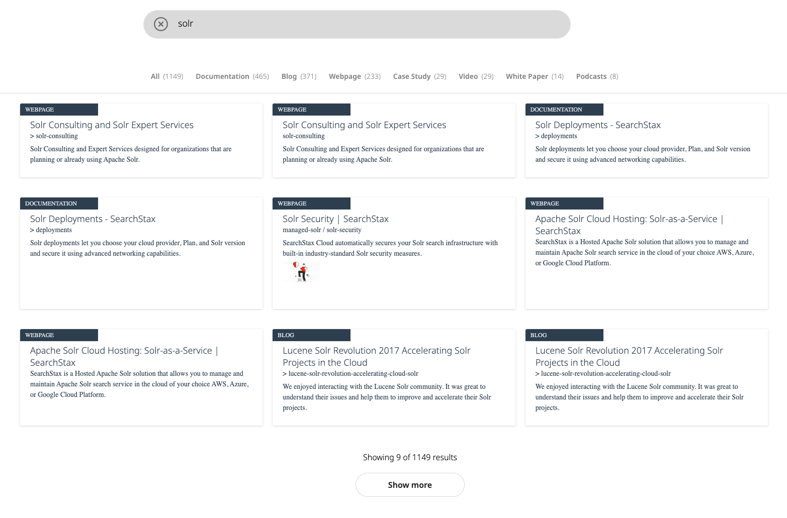

## Facet Values as Tabs and Show More


### Usage

- Run the commands:
```shell
$ npm install
$ npm run dev
```
- Open [http://localhost:1234](http://localhost:1234)

### HTML Structure

The main HTML file is `src/index.html`.


### JavaScript Widgets

The main JavaScript file `src/index.js` imports and initializes several widgets from the `@searchstax-inc/searchstudio-ux-js` library. These widgets add search functionality to the web application.

1. Search Input Widget: This widget provides a search input field. It is added to the `searchstax-input-container` div in the HTML file.

```JS
searchstax.addSearchInputWidget("searchstax-input-container", {

    templates: {
    mainTemplate: {
        template: searchInput,
        searchInputId: "searchstax-search-input"
    },
    },
  });
```

2. Facets Widget: This widget provides a way to filter search results based on certain criteria. It is added to the `searchstax-facets-container` div in the HTML file.
The property `facetingType: "tabs"` allows to see the facets as Tabs

```JS
searchstax.addFacetsWidget("searchstax-facets-container", {
    facetingType: "tabs",
    itemsPerPageDesktop: 9999,
    itemsPerPageMobile: 99,
    templates: {
        mainTemplateDesktop: {
            template: facetsTemplate,
        },
        facetItemTemplate: facetItemTemplate,
        facetItemContainerTemplate: facetItemContainerTemplate
    },

});
```
In `index.js`, the following custom codes adds an additional "All" tab to the facets
```JS
searchstax.dataLayer.$facetsTemplateData.subscribe((facets) => {
    // console.log(`Facets: ${facets}`);
    if(facets) {
      let data = facets.facets[0].values;
      let sum = data.reduce((acc, item) => acc + item.count, 0);
      // form a similar object as the data with sum as the count and value as 'All'
      let allObj = {
          count: sum,
          value: 'All',
          parentName: 'content_type',
          type: 'checkbox',
      };
      //push the all object to the front of data
      data.unshift(allObj);

      // replace facets with the new data
      facets.facets[0].values = data;
    }
    // console.log(data);
  });
);
```
`config.js` defines a hook `beforeSearch` that processes this custom added "All" facet, and resets the search to work for this.

3. Search Feedback Widget: This widget provides feedback on the search results. It is added to the `search-feedback-container` div in the HTML file.
;

```JS
searchstax.addSearchFeedbackWidget("search-feedback-container", {
    templates: {
      main: {
          template: searchFeedback,
          originalQueryClass: `searchstax-feedback-original-query`
      }
    },
  });
```

4. Pagination Widget: This widget provides pagination for the search results. It is added to the `searchstax-pagination-container` div in the HTML file.
This example shows Infinite pagination using the "Show More button"

```JS
searchstax.addPaginationWidget("searchstax-pagination-container", {
    templates: {
        infiniteScrollTemplate: {
            template: `
                {{#results.length}}
                    <div class="searchstax-pagination-container">
                      <div class="searchstax-pagination-content">
                        Showing  {{endResultIndex}} of {{totalResults}} results
                        <a class="searchstax-pagination-next {{#isLastPage}}disabled{{/isLastPage}}" id="searchstax-pagination-next">Show more</a>
                      </div>
                    </div>
                {{/results.length}}

                `,
            loadMoreButtonClass: "searchstax-pagination-load-more"
        }
    },
  });
```

Each widget is initialized with a configuration object that specifies its behavior and appearance. The templates for these widgets are defined in separate JavaScript files and imported into src/index.js.

### Parcel Bundler

Parcel is a web application bundler that is used in this project, as specified in the 	`package.json` file.

For more information on how to use and configure Parcel, refer to the [official Parcel documentation](https://parceljs.org/docs/).

