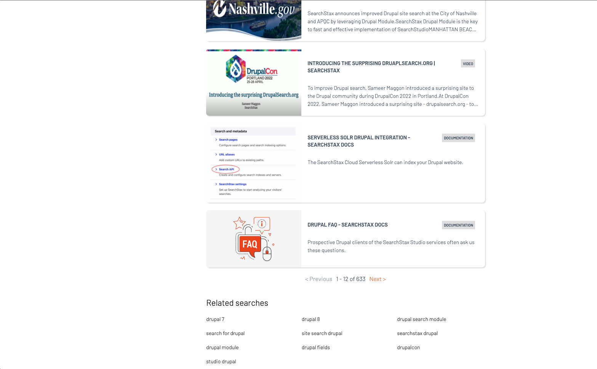

# Searchstax Accelerator Page

<br/>

## Description
Searchstax Accelerator Demo demonstrates the integration of various widgets provided by the `@searchstax-inc/searchstudio-ux-js library`.

<br/>

## Usage
1. Clone the repository
2. Install the dependencies
```bash
$ npm install
```
3. Start the server 
```bash
$ npm run dev
```

4. Open http://localhost:1234/ in your browser

5. You would see the following in your browser:


6. Fire a quick search
<br/><br/>


