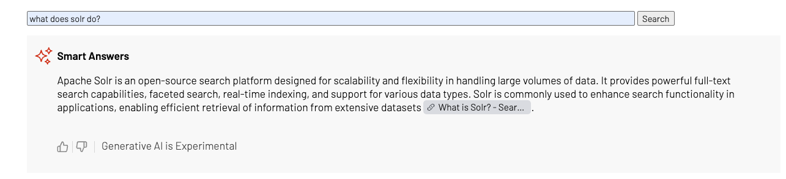
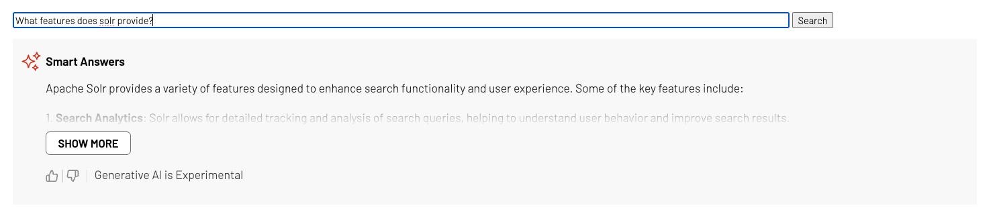

## Searchstax Smart Answers Standalone Page

This sample shows how to add the SearchStax Smart Answers widget to a custom search implementation using the SearchStax JavaScript UX library.

Smart Answers lets visitors ask natural-language questions and receive AI-generated answers based on the site’s indexed content. The answer appears above the standard search results and can include citations and visitor feedback controls.


### Smart Answers 


### Smart Answers with Show More
 |


## When to use this sample

Use this sample when a client has a custom search results page and wants to add Smart Answers without using the hosted SearchStax search experience.

Typical use cases include:

- Custom HTML, JavaScript, or CMS search pages
- Client-owned search UI implementations
- Proof-of-concept demos for Smart Answers
- Sites that already use SearchStax Site Search APIs or widgets

## Prerequisites

Before using this sample, confirm that:

1. Smart Answers is enabled for the client’s SearchStax account.
2. Smart Answers is enabled and published for the target Search Profile.
3. The site’s search relevance is already tuned enough to return high-quality results.
4. The client has the Smart Answers API endpoint and read-only token from SearchStax.

The Smart Answers endpoint is available in:

`Site Search > App Settings > All APIs > Search & Indexing > Smart Answers API`


## Installation

Install dependencies:
```bash
npm install
```

Run the local development server:
```bash
npm run dev
```
- Open [http://localhost:1234](http://localhost:1234) / The link shown on your console

Build for production:
```bash
npm run build
```

Preview the production build:
```bash
npm run preview
```

## How the sample works

The main HTML file is [index.html](./index.html). It has the following block of custom implementation of search input that does not fire search just imitates custom implementations:
```html
<input id="custom-query-input"></input>
<button id="custom-search-button">Search</button>
```

The sample imports the SearchStax JavaScript UX library:
```typescript
import { Searchstax } from "@searchstax-inc/searchstudio-ux-js";
```

It creates a SearchStax instance and initializes it using the standalone sample configuration:
```typescript
const searchstax = new Searchstax();

searchstax.initialize({
  ...initConfig.searchStandaloneSearchSample,
  sessionId: makeId(25),
});

The Smart Answers widget is then attached to an HTML container:

searchstax.addAnswerWidget("searchstax-answer-container", {
  showMoreAfterWordCount: 100,
  templates: {
    main: {
      template: `...`,
    },
  },
  feedbackwidget: {
    renderFeedbackWidget: true,
    emailOverride: () => {
      return "";
    },
    thumbsUpValue: 10,
    thumbsDownValue: 0,
  },
});
```

in [main.ts](./src/main.ts)  there is `window.onload` function which adds custom implementation for these elements and `triggerSearchStaxReload` function which connects those inputs to trigger reload on answers wigget.
```typescript
function triggerSearchStaxReload(query: string) {
  searchstax.dataLayer.setSearchObject({
    ...searchstax.dataLayer.searchObject,
    query: query,
    page: 1,
  });
}

// ondocument load
window.onload = function () {
  const customQueryInput = document.getElementById("custom-query-input") as HTMLInputElement;
  const customSearchButton = document.getElementById("custom-search-button") as HTMLButtonElement;

  customSearchButton.addEventListener("click", function () {
    const query = customQueryInput.value;
    triggerSearchStaxReload(query);
  });
```
