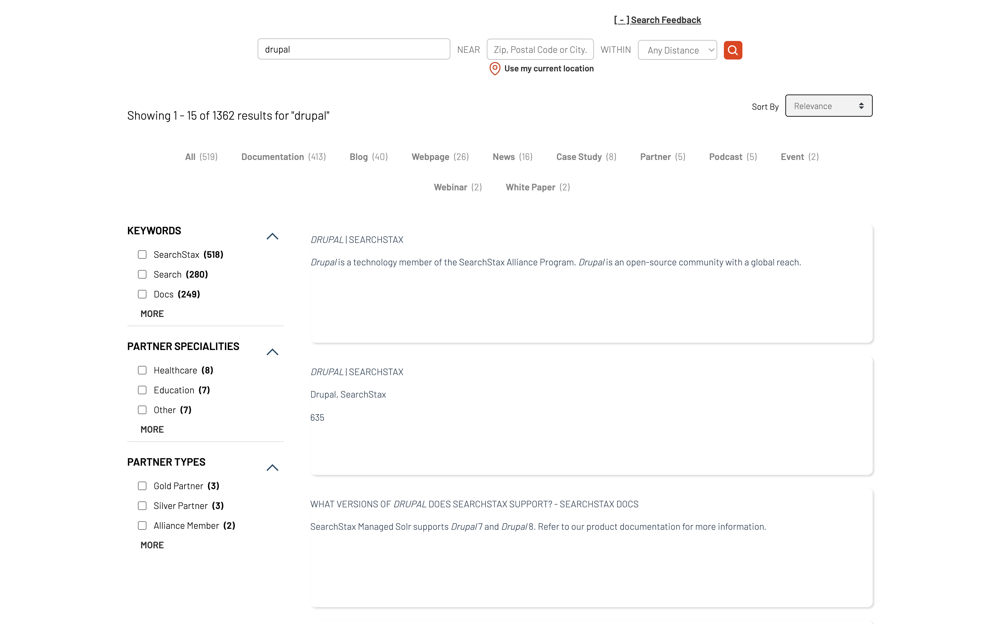

## Template for Tabbed Navigation using one of the Facets


### Usage

- Run the commands:
```shell
$ npm install
$ npm run dev
```
- Open [http://localhost:5173](http://localhost:5173)

### HTML Structure

The main HTML file is `index.html`.


### JavaScript Widgets & Customizations

The main file `src/main.ts` imports and initializes several widgets from the `@searchstax-inc/searchstudio-ux-js` library. These widgets add search functionality to the web application.

This template uses the searchstax-accelerator-page template as its base, meaning everything included in that template is also available in this one, along with a few modifications to display one of the facets as tabs. This allows users to navigate using the tabs at the top, in addition to normal filtering interactions for the remaining facet categories.

Here are the customizations made on top of the base template:

1. Facets Widget: This widget provides a way to filter search results based on certain criteria. It is added to the `searchstax-facet-tabs-container` div in the HTML file.
The property `facetingType: "tabs"` allows to see the facets as Tabs

```JS
searchstax.addFacetsWidget("searchstax-facet-tabs-container", {
    facetingType: "tabs",
    itemsPerPageDesktop: 9999,
    itemsPerPageMobile: 99,
    templates: {
        mainTemplateDesktop: {
            template: facetsTemplate,
        },
        facetItemTemplate: facetItemTemplate,
        facetItemContainerTemplate: facetItemContainerTemplate
    },

});
```

2. In `main.ts`, the following custom codes adds an additional "All" tab to the facets
```JS
searchstax.dataLayer.$facetsTemplateData.subscribe((facets) => {
  if (
    facets &&
    facets.facets &&
    facets.facets.length > 0 &&
    facets.facets[0].name === facetTabName
  ) {
    let data = facets.facets[0].values;
    let sum = data.reduce(
      (acc: number, item: { count: number }) => acc + item.count,
      0,
    );
    // form a similar object as the data with sum as the count and value as 'All'
    let allObj = {
      count: sum,
      value: allTabsLabel,
      parentName: facetTabName,
      type: "checkbox",
    };
    //push the all object to the front of data
    data.unshift(allObj);

    // replace facets with the new data
    facets.facets[0].values = data;
  }
  // console.log(data);
});
```
`main.ts` defines a hook `beforeSearch` that processes this custom added "All" facet, and resets the search to work for this.
